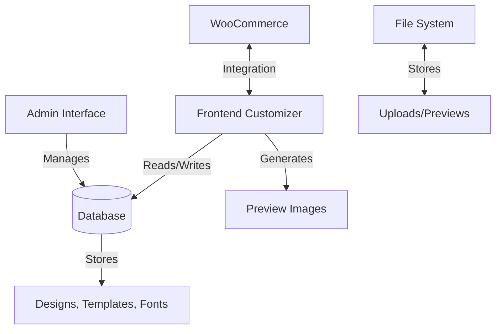

# CustomKings Product Personalizer - Technical Documentation

## Overview
CustomKings Product Personalizer is a WordPress plugin that enables product personalization for WooCommerce stores. It provides a visual designer interface in the admin area and a frontend customizer for customers to personalize products.

## Architecture

### System Diagram


## Core Components

### 1. Main Plugin File (CustomKings.php)
```php
class CustomKings_Product_Personalizer {
    private $frontend_customizer = null;
    private $admin_ui = null;
    private $product_designer = null;
    
    public function __construct() {
        require_once plugin_dir_path(__FILE__) . 'admin/class-fonts.php';
        new CKPP_Fonts();
        require_once plugin_dir_path(__FILE__) . 'includes/class-frontend-customizer.php';
        $this->frontend_customizer = new CKPP_Frontend_Customizer();
        
        if (is_admin()) {
            require_once plugin_dir_path(__FILE__) . 'admin/class-admin-ui.php';
            require_once plugin_dir_path(__FILE__) . 'admin/class-clipart.php';
            require_once plugin_dir_path(__FILE__) . 'admin/class-product-designer.php';
            $this->admin_ui = new CKPP_Admin_UI();
            $this->product_designer = new CKPP_Product_Designer();
        }
    }
}
```

### 2. Admin Interface (admin/class-admin-ui.php)
**Key Methods:**
- `render_designs_page()`: Main designer interface
- `handle_design_actions()`: CRUD operations
- `enqueue_admin_assets()`: Loads required CSS/JS

### 3. Product Designer (admin/class-product-designer.php)
**Key Features:**
- Canvas manipulation
- Layer management
- Template system
- Font handling

### 4. Frontend Customizer (includes/class-frontend-customizer.php)
**Key Methods:**
- `ajax_get_config()`: Fetches product configuration
- `add_cart_item_data()`: Handles cart integration
- `render_live_preview()`: Generates preview images

## Database Schema

### Custom Tables
```sql
CREATE TABLE `wp_ckpp_clipart` (
    `id` bigint(20) NOT NULL AUTO_INCREMENT,
    `name` varchar(255) NOT NULL,
    `url` text NOT NULL,
    `category` varchar(100) DEFAULT NULL,
    `created_at` datetime DEFAULT CURRENT_TIMESTAMP,
    PRIMARY KEY (`id`)
);

CREATE TABLE `wp_ckpp_fonts` (
    `id` bigint(20) NOT NULL AUTO_INCREMENT,
    `name` varchar(255) NOT NULL,
    `file_name` varchar(255) NOT NULL,
    `file_url` text NOT NULL,
    `font_family` varchar(255) NOT NULL,
    `created_at` datetime DEFAULT CURRENT_TIMESTAMP,
    PRIMARY KEY (`id`),
    UNIQUE KEY `font_family` (`font_family`)
);
```

## API Endpoints

### AJAX Endpoints
1. **Design Management**
   - `ckpp_save_design`: Saves design data
   - `ckpp_load_design`: Loads design configuration
   - `ckpp_delete_design`: Removes a design

2. **Asset Handling**
   - `ckpp_upload_image`: Handles image uploads
   - `ckpp_upload_font`: Manages font uploads
   - `ckpp_get_fonts`: Returns available fonts

3. **Frontend**
   - `ckpp_get_product_config`: Gets product configuration
   - `ckpp_generate_preview`: Creates preview images
   - `ckpp_save_customization`: Saves customer customizations

## Code Examples

### 1. Saving a Design (AJAX Handler)
```php
public function ajax_save_design() {
    check_ajax_referer('ckpp_designer_nonce', 'nonce');
    if (!current_user_can('manage_options')) {
        wp_send_json_error(['message' => 'Unauthorized']);
    }
    
    $design_id = intval($_POST['designId']);
    $title = sanitize_text_field($_POST['title']);
    $config = wp_unslash($_POST['config']);
    
    // Save logic here
    
    wp_send_json_success([
        'designId' => $design_id,
        'message' => 'Design saved successfully'
    ]);
}
```

### 2. Frontend Initialization
```javascript
// assets/customizer.js
function initCustomizer() {
    const modal = new CustomizerModal({
        productId: CKPPCustomizer.productId,
        onSave: function(designData) {
            // Handle save
        }
    });
    modal.show();
}
```

## Security Implementation

### 1. Input Validation
```php
public function handle_file_upload() {
    if (!isset($_FILES['upload'])) {
        wp_send_json_error('No file uploaded');
    }
    
    $file = $_FILES['upload'];
    $allowed_types = ['image/jpeg', 'image/png', 'image/gif'];
    
    if (!in_array($file['type'], $allowed_types)) {
        wp_send_json_error('Invalid file type');
    }
    
    // Process upload
}
```

### 2. Capability Checking
```php
public function admin_page() {
    if (!current_user_can('manage_options')) {
        wp_die('Access denied');
    }
    // Render admin page
}
```

## Performance Optimization

### 1. Asset Loading
```php
public function enqueue_assets($hook) {
    if ('toplevel_page_ckpp_designer' !== $hook) {
        return;
    }
    
    wp_enqueue_style(
        'ckpp-designer',
        plugins_url('assets/css/designer.css', __FILE__),
        [],
        filemtime(plugin_dir_path(__FILE__) . 'assets/css/designer.css')
    );
    
    // Load only necessary scripts
    wp_enqueue_script(
        'ckpp-designer',
        plugins_url('assets/js/designer.js', __FILE__),
        ['jquery', 'wp-util'],
        filemtime(plugin_dir_path(__FILE__) . 'assets/js/designer.js'),
        true
    );
}
```

## Testing Strategy

### 1. Unit Tests
```php
class DesignerTest extends WP_UnitTestCase {
    public function test_design_save() {
        $designer = new CKPP_Product_Designer();
        $result = $designer->save_design([
            'title' => 'Test Design',
            'config' => '{"objects":[]}'
        ]);
        $this->assertIsInt($result);
    }
}
```

### 2. Integration Tests
```javascript
// tests/integration/designer.test.js
describe('Designer Integration', () => {
    it('should load design data', async () => {
        const response = await fetch('/wp-admin/admin-ajax.php', {
            method: 'POST',
            body: new URLSearchParams({
                action: 'ckpp_load_design',
                design_id: '123',
                nonce: 'valid_nonce'
            })
        });
        expect(response.status).toBe(200);
    });
});
```

## Deployment

### 1. Build Process
```bash
# Install dependencies
npm install

# Build assets
npm run build

# Create package
zip -r customkings.zip . -x "*.git*" "node_modules/*" "*.DS_Store"
```

### 2. Version Control
```
.gitignore
---------
node_modules/
vendor/
*.log
*.zip
.DS_Store
```

## Future Enhancements

### 1. Architecture
- Migrate to React/Vue for better state management
- Implement REST API endpoints
- Add WebSocket for real-time collaboration

### 2. Performance
- Implement service workers for offline support
- Add image CDN integration
- Optimize database queries

### 3. Features
- AI-powered design suggestions
- 3D product preview
- Integration with print-on-demand services

## Troubleshooting

### Common Issues
1. **Designs not saving**
   - Verify write permissions
   - Check PHP error logs
   - Verify nonce validation

2. **Images not uploading**
   - Check PHP upload limits
   - Verify file permissions
   - Check for PHP GD/Imagick

3. **Fonts not loading**
   - Verify font files exist
   - Check MIME types
   - Inspect browser console for CORS issues

## Support
For support, please contact:
- Email: support@customkings.com.au
- Website: https://customkings.com.au
