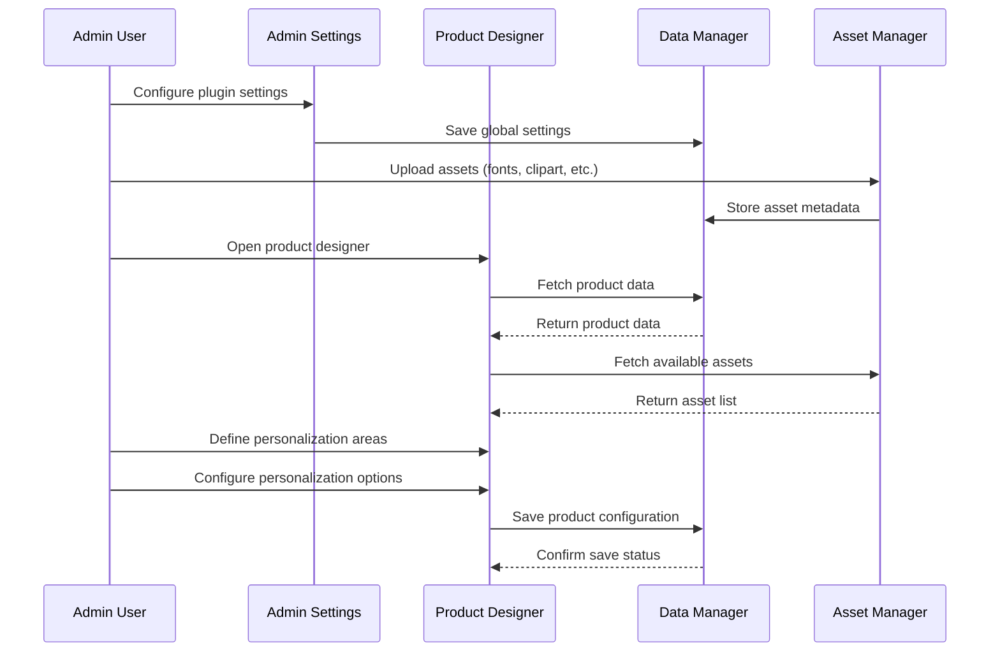
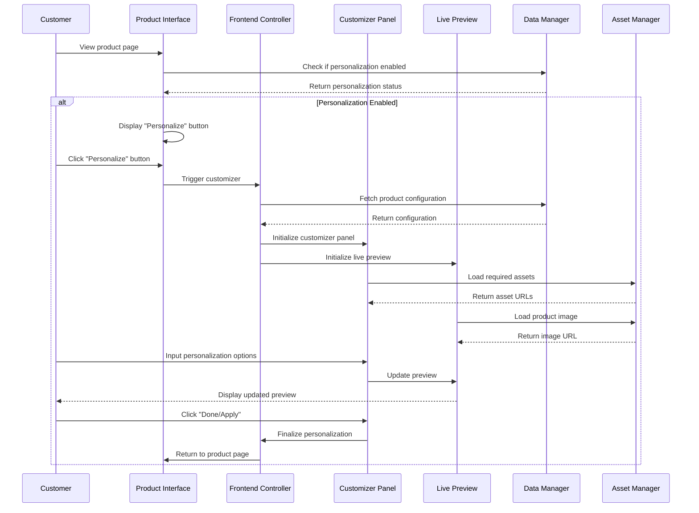
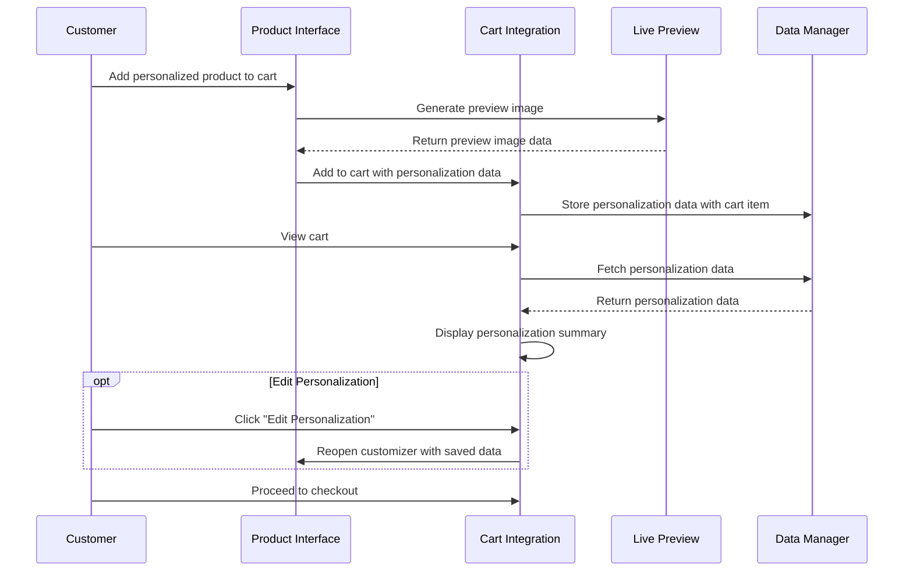
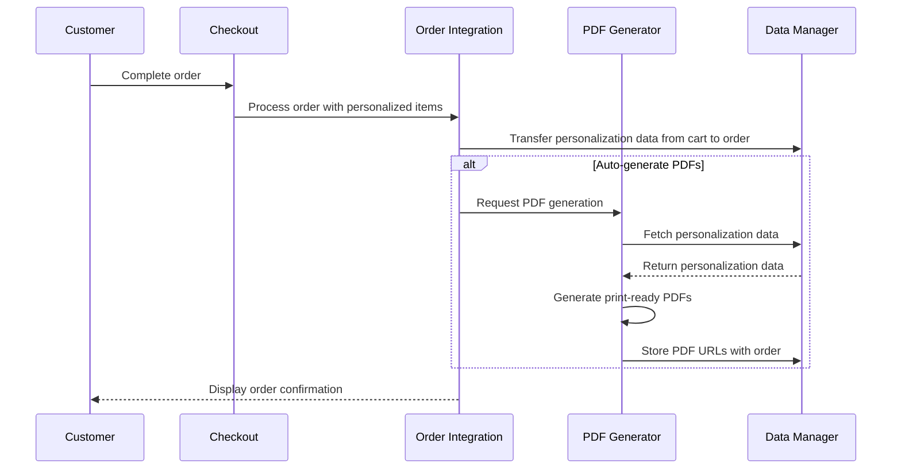
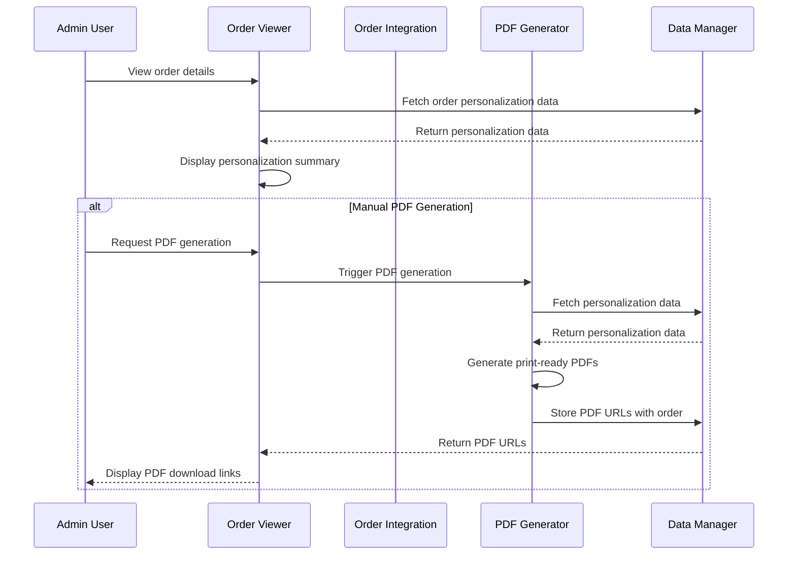
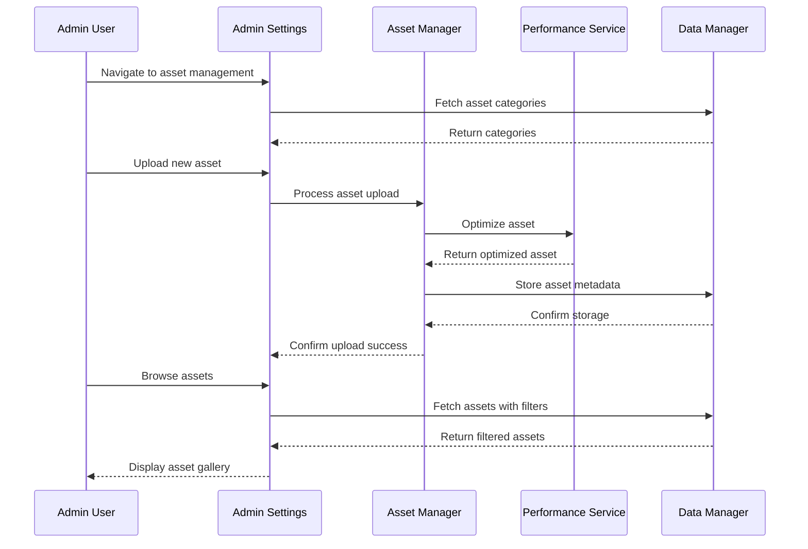
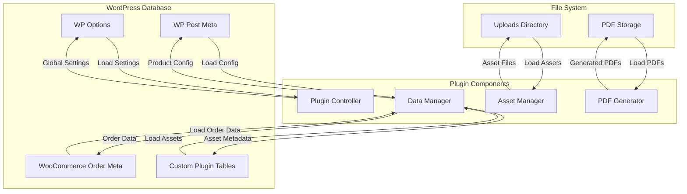
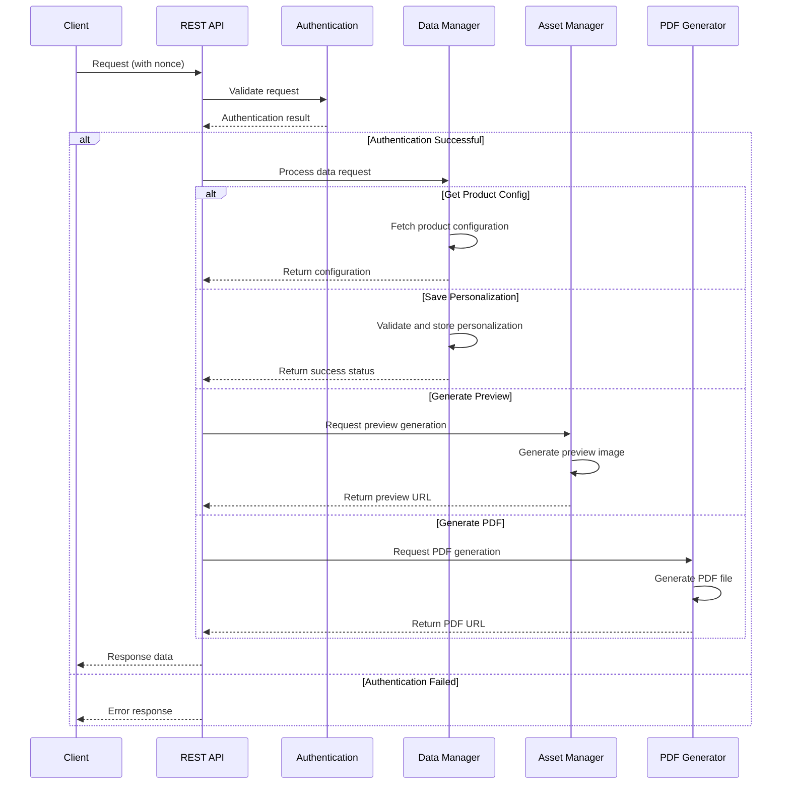
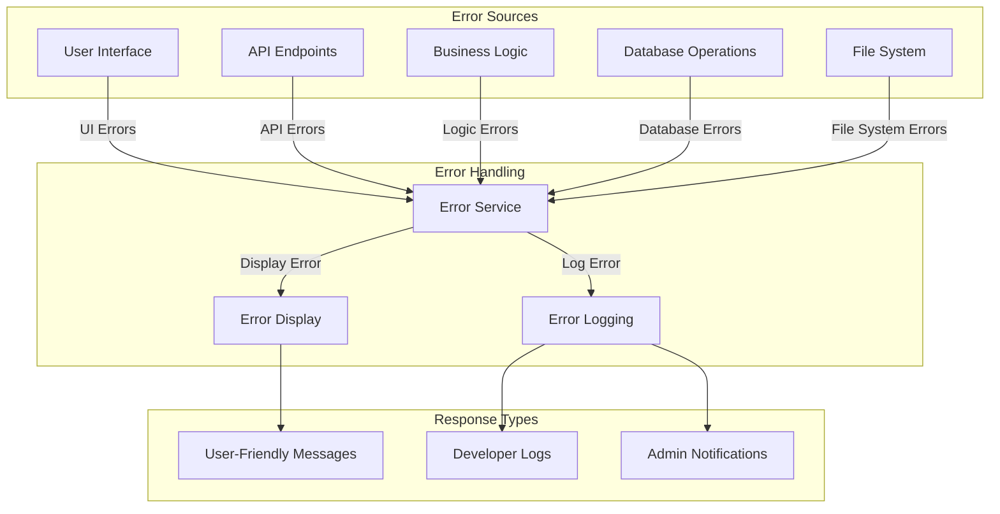

# Data Flow Diagrams

This document illustrates the key data flows between components in the WordPress/WooCommerce Product Personalization Plugin.

## 1. Admin Configuration Flow



## 2. Frontend Personalization Flow



## 3. Cart and Checkout Flow



## 4. Order Processing Flow



## 5. Admin Order Management Flow



## 6. Asset Management Flow



## 7. Data Persistence Flow



## 8. REST API Data Flow



## 9. Error Handling Flow



## 10. Performance Optimization Flow

```mermaid
flowchart TD
    subgraph "Asset Requests"
        AR[Asset Request]
        CR[Config Request]
        PR[Preview Request]
    end
    
    subgraph "Performance Services"
        PS[Performance Service]
        CACHE[Caching Layer]
        LAZY[Lazy Loading]
        OPT[Asset Optimization]
    end
    
    subgraph "Response"
        FAST[Optimized Response]
    end
    
    AR -->|Request Asset| PS
    CR -->|Request Config| PS
    PR -->|Generate Preview| PS
    
    PS -->|Check Cache| CACHE
    CACHE -->|Cache Hit| FAST
    CACHE -->|Cache Miss| PS
    
    PS -->|Load Assets| LAZY
    PS -->|Optimize| OPT
    
    LAZY --> FAST
    OPT --> FAST
    PS -->|Store in Cache| CACHE