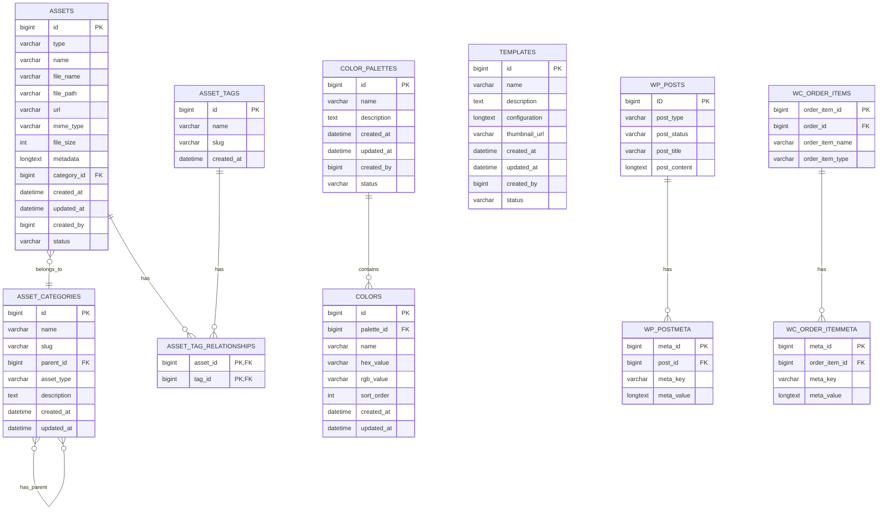

# Database Schema Design

This document outlines the database schema for the WordPress/WooCommerce Product Personalization Plugin, including custom tables and WordPress/WooCommerce meta fields.

## 1. Custom Tables

### 1.1 Assets Table

**Table Name:** `{wp_prefix}_product_personalizer_assets`

| Column | Type | Description |
|--------|------|-------------|
| `id` | BIGINT(20) UNSIGNED | Primary key, auto-increment |
| `type` | VARCHAR(50) | Asset type (font, image, clipart, color) |
| `name` | VARCHAR(255) | Asset name |
| `file_name` | VARCHAR(255) | Original file name |
| `file_path` | VARCHAR(255) | Path to the asset file |
| `url` | VARCHAR(255) | URL to access the asset |
| `mime_type` | VARCHAR(100) | MIME type of the asset |
| `file_size` | INT UNSIGNED | File size in bytes |
| `metadata` | LONGTEXT | JSON-encoded metadata |
| `category_id` | BIGINT(20) UNSIGNED | Foreign key to categories table (optional) |
| `created_at` | DATETIME | Creation timestamp |
| `updated_at` | DATETIME | Last update timestamp |
| `created_by` | BIGINT(20) UNSIGNED | User ID who created the asset |
| `status` | VARCHAR(20) | Status (active, inactive, deleted) |

**Indexes:**
- PRIMARY KEY (`id`)
- KEY `type_index` (`type`)
- KEY `category_index` (`category_id`)
- KEY `status_index` (`status`)

### 1.2 Asset Categories Table

**Table Name:** `{wp_prefix}_product_personalizer_asset_categories`

| Column | Type | Description |
|--------|------|-------------|
| `id` | BIGINT(20) UNSIGNED | Primary key, auto-increment |
| `name` | VARCHAR(255) | Category name |
| `slug` | VARCHAR(255) | Category slug |
| `parent_id` | BIGINT(20) UNSIGNED | Parent category ID (for hierarchical categories) |
| `asset_type` | VARCHAR(50) | Asset type this category applies to |
| `description` | TEXT | Category description |
| `created_at` | DATETIME | Creation timestamp |
| `updated_at` | DATETIME | Last update timestamp |

**Indexes:**
- PRIMARY KEY (`id`)
- UNIQUE KEY `slug_index` (`slug`)
- KEY `parent_index` (`parent_id`)
- KEY `asset_type_index` (`asset_type`)

### 1.3 Asset Tags Table

**Table Name:** `{wp_prefix}_product_personalizer_asset_tags`

| Column | Type | Description |
|--------|------|-------------|
| `id` | BIGINT(20) UNSIGNED | Primary key, auto-increment |
| `name` | VARCHAR(255) | Tag name |
| `slug` | VARCHAR(255) | Tag slug |
| `created_at` | DATETIME | Creation timestamp |

**Indexes:**
- PRIMARY KEY (`id`)
- UNIQUE KEY `slug_index` (`slug`)

### 1.4 Asset Tag Relationships Table

**Table Name:** `{wp_prefix}_product_personalizer_asset_tag_relationships`

| Column | Type | Description |
|--------|------|-------------|
| `asset_id` | BIGINT(20) UNSIGNED | Foreign key to assets table |
| `tag_id` | BIGINT(20) UNSIGNED | Foreign key to tags table |

**Indexes:**
- PRIMARY KEY (`asset_id`, `tag_id`)
- KEY `tag_index` (`tag_id`)

### 1.5 Color Palettes Table

**Table Name:** `{wp_prefix}_product_personalizer_color_palettes`

| Column | Type | Description |
|--------|------|-------------|
| `id` | BIGINT(20) UNSIGNED | Primary key, auto-increment |
| `name` | VARCHAR(255) | Palette name |
| `description` | TEXT | Palette description |
| `created_at` | DATETIME | Creation timestamp |
| `updated_at` | DATETIME | Last update timestamp |
| `created_by` | BIGINT(20) UNSIGNED | User ID who created the palette |
| `status` | VARCHAR(20) | Status (active, inactive) |

**Indexes:**
- PRIMARY KEY (`id`)
- KEY `status_index` (`status`)

### 1.6 Colors Table

**Table Name:** `{wp_prefix}_product_personalizer_colors`

| Column | Type | Description |
|--------|------|-------------|
| `id` | BIGINT(20) UNSIGNED | Primary key, auto-increment |
| `palette_id` | BIGINT(20) UNSIGNED | Foreign key to palettes table |
| `name` | VARCHAR(255) | Color name |
| `hex_value` | VARCHAR(7) | Hex color code |
| `rgb_value` | VARCHAR(20) | RGB color values |
| `sort_order` | INT UNSIGNED | Sort order within palette |
| `created_at` | DATETIME | Creation timestamp |
| `updated_at` | DATETIME | Last update timestamp |

**Indexes:**
- PRIMARY KEY (`id`)
- KEY `palette_index` (`palette_id`)

### 1.7 Templates Table (Optional)

**Table Name:** `{wp_prefix}_product_personalizer_templates`

| Column | Type | Description |
|--------|------|-------------|
| `id` | BIGINT(20) UNSIGNED | Primary key, auto-increment |
| `name` | VARCHAR(255) | Template name |
| `description` | TEXT | Template description |
| `configuration` | LONGTEXT | JSON-encoded configuration data |
| `thumbnail_url` | VARCHAR(255) | URL to template thumbnail |
| `created_at` | DATETIME | Creation timestamp |
| `updated_at` | DATETIME | Last update timestamp |
| `created_by` | BIGINT(20) UNSIGNED | User ID who created the template |
| `status` | VARCHAR(20) | Status (active, inactive, deleted) |

**Indexes:**
- PRIMARY KEY (`id`)
- KEY `status_index` (`status`)

## 2. WordPress/WooCommerce Meta Fields

### 2.1 Product Meta

| Meta Key | Description | Type |
|----------|-------------|------|
| `_product_personalization_enabled` | Flag indicating if personalization is enabled for the product | Boolean (0/1) |
| `_product_personalization_config_json` | JSON-encoded personalization configuration | JSON |

**Example `_product_personalization_config_json` Structure:**

```json
{
  "version": "1.0",
  "areas": [
    {
      "id": "area1",
      "name": "Front Design",
      "x": 100,
      "y": 150,
      "width": 300,
      "height": 200,
      "rotation": 0,
      "z_index": 1,
      "options": [
        {
          "id": "text1",
          "type": "text",
          "label": "Custom Text",
          "default_value": "Your Text Here",
          "constraints": {
            "max_length": 50,
            "min_length": 1,
            "required": true
          },
          "style": {
            "font_id": 123,
            "font_size": 24,
            "color": "#000000",
            "alignment": "center"
          }
        },
        {
          "id": "image1",
          "type": "image",
          "label": "Upload Your Image",
          "constraints": {
            "max_size": 5242880,
            "allowed_types": ["image/jpeg", "image/png"],
            "max_width": 1000,
            "max_height": 1000
          }
        },
        {
          "id": "clipart1",
          "type": "clipart",
          "label": "Choose Clipart",
          "default_value": null,
          "constraints": {
            "category_ids": [1, 2, 3]
          }
        },
        {
          "id": "color1",
          "type": "color",
          "label": "Choose Color",
          "default_value": "#ff0000",
          "constraints": {
            "palette_id": 5
          }
        }
      ]
    }
  ],
  "price_modifiers": [
    {
      "id": "text_price",
      "type": "fixed",
      "value": 5.00,
      "applies_to": {
        "option_id": "text1",
        "condition": "any"
      }
    },
    {
      "id": "image_price",
      "type": "percentage",
      "value": 10.00,
      "applies_to": {
        "option_id": "image1",
        "condition": "any"
      }
    }
  ],
  "settings": {
    "preview_image": "product_image",
    "allow_multiple_areas": true,
    "require_all_options": false
  }
}
```

### 2.2 Order Item Meta

| Meta Key | Description | Type |
|----------|-------------|------|
| `_personalization_data` | JSON-encoded personalization choices | JSON |
| `_personalization_preview_url` | URL to the preview image | String |
| `_personalization_print_file_url` | URL to the print-ready file | String |

**Example `_personalization_data` Structure:**

```json
{
  "version": "1.0",
  "product_id": 123,
  "areas": [
    {
      "id": "area1",
      "options": [
        {
          "id": "text1",
          "type": "text",
          "value": "Happy Birthday John!",
          "style": {
            "font_id": 123,
            "font_size": 24,
            "color": "#000000",
            "alignment": "center"
          }
        },
        {
          "id": "image1",
          "type": "image",
          "value": "https://example.com/uploads/customer_image_123.jpg"
        },
        {
          "id": "clipart1",
          "type": "clipart",
          "value": 42,
          "transform": {
            "scale": 1.2,
            "rotation": 45
          }
        },
        {
          "id": "color1",
          "type": "color",
          "value": "#ff0000"
        }
      ]
    }
  ],
  "price_modifiers_applied": [
    {
      "id": "text_price",
      "type": "fixed",
      "value": 5.00
    },
    {
      "id": "image_price",
      "type": "percentage",
      "value": 10.00
    }
  ],
  "total_price_modification": 15.00
}
```

## 3. Database Schema Diagram



## 4. Database Migration Strategy

### 4.1 Initial Installation

On plugin activation, the following steps will be executed:

1. Check if tables already exist
2. Create all required custom tables if they don't exist
3. Add default data (e.g., default color palettes)
4. Set up initial plugin settings in WordPress options table

```php
function create_database_tables() {
    global $wpdb;
    $charset_collate = $wpdb->get_charset_collate();
    
    // Assets table
    $table_name = $wpdb->prefix . 'product_personalizer_assets';
    $sql = "CREATE TABLE $table_name (
        id bigint(20) UNSIGNED NOT NULL AUTO_INCREMENT,
        type varchar(50) NOT NULL,
        name varchar(255) NOT NULL,
        file_name varchar(255) NOT NULL,
        file_path varchar(255) NOT NULL,
        url varchar(255) NOT NULL,
        mime_type varchar(100) NOT NULL,
        file_size int UNSIGNED NOT NULL DEFAULT 0,
        metadata longtext,
        category_id bigint(20) UNSIGNED,
        created_at datetime NOT NULL,
        updated_at datetime NOT NULL,
        created_by bigint(20) UNSIGNED NOT NULL,
        status varchar(20) NOT NULL DEFAULT 'active',
        PRIMARY KEY  (id),
        KEY type_index (type),
        KEY category_index (category_id),
        KEY status_index (status)
    ) $charset_collate;";
    
    // Additional tables...
    
    require_once(ABSPATH . 'wp-admin/includes/upgrade.php');
    dbDelta($sql);
}
```

### 4.2 Version Updates

For plugin updates that require database changes:

1. Check current database version against plugin version
2. Run appropriate migration scripts for the version gap
3. Update database version in WordPress options

```php
function update_database_schema() {
    $current_db_version = get_option('product_personalizer_db_version', '1.0');
    $plugin_version = PRODUCT_PERSONALIZER_VERSION;
    
    if (version_compare($current_db_version, '1.1', '<')) {
        // Run 1.1 migration
        migrate_to_1_1();
    }
    
    if (version_compare($current_db_version, '1.2', '<')) {
        // Run 1.2 migration
        migrate_to_1_2();
    }
    
    // Update stored db version
    update_option('product_personalizer_db_version', $plugin_version);
}
```

### 4.3 Uninstallation

On plugin uninstallation (if the user chooses to remove data):

1. Drop all custom tables
2. Remove all plugin-related post meta
3. Remove all plugin-related order item meta
4. Remove all plugin options

```php
function remove_database_tables() {
    global $wpdb;
    
    $tables = [
        $wpdb->prefix . 'product_personalizer_assets',
        $wpdb->prefix . 'product_personalizer_asset_categories',
        $wpdb->prefix . 'product_personalizer_asset_tags',
        $wpdb->prefix . 'product_personalizer_asset_tag_relationships',
        $wpdb->prefix . 'product_personalizer_color_palettes',
        $wpdb->prefix . 'product_personalizer_colors',
        $wpdb->prefix . 'product_personalizer_templates'
    ];
    
    foreach ($tables as $table) {
        $wpdb->query("DROP TABLE IF EXISTS $table");
    }
    
    // Remove post meta
    $wpdb->delete($wpdb->postmeta, ['meta_key' => '_product_personalization_enabled']);
    $wpdb->delete($wpdb->postmeta, ['meta_key' => '_product_personalization_config_json']);
    
    // Remove order item meta
    $wpdb->query("DELETE FROM {$wpdb->prefix}woocommerce_order_itemmeta WHERE meta_key IN ('_personalization_data', '_personalization_preview_url', '_personalization_print_file_url')");
    
    // Remove options
    delete_option('product_personalizer_settings');
    delete_option('product_personalizer_db_version');
}
```

## 5. Query Optimization Strategies

### 5.1 Indexing Strategy

The schema includes carefully selected indexes to optimize common queries:

- Primary keys on all tables for efficient lookups
- Foreign key indexes for join operations
- Status indexes for filtering active/inactive records
- Type indexes for filtering by asset type
- Slug indexes for quick lookups by slug

### 5.2 Caching Strategy

To minimize database queries:

1. **Transient API:** Cache frequently accessed data using WordPress Transient API
   ```php
   // Get assets with caching
   function get_assets_by_type($type) {
       $cache_key = 'pp_assets_' . $type;
       $assets = get_transient($cache_key);
       
       if (false === $assets) {
           global $wpdb;
           $table = $wpdb->prefix . 'product_personalizer_assets';
           $assets = $wpdb->get_results($wpdb->prepare(
               "SELECT * FROM $table WHERE type = %s AND status = 'active'",
               $type
           ));
           
           set_transient($cache_key, $assets, HOUR_IN_SECONDS);
       }
       
       return $assets;
   }
   ```

2. **Object Caching:** Leverage WordPress object cache for repeated queries within a request
   ```php
   // Get product configuration with object caching
   function get_product_config($product_id) {
       $cache_key = 'pp_product_config_' . $product_id;
       $config = wp_cache_get($cache_key);
       
       if (false === $config) {
           $config = get_post_meta($product_id, '_product_personalization_config_json', true);
           wp_cache_set($cache_key, $config);
       }
       
       return $config;
   }
   ```

3. **Cache Invalidation:** Clear caches when data is updated
   ```php
   // Invalidate cache when asset is updated
   function update_asset($asset_id, $data) {
       global $wpdb;
       $table = $wpdb->prefix . 'product_personalizer_assets';
       
       // Update asset
       $wpdb->update($table, $data, ['id' => $asset_id]);
       
       // Invalidate cache
       $asset = $wpdb->get_row($wpdb->prepare(
           "SELECT type FROM $table WHERE id = %d",
           $asset_id
       ));
       
       delete_transient('pp_assets_' . $asset->type);
   }
   ```

### 5.3 Query Optimization

Optimize database queries by:

1. **Selecting only needed columns:**
   ```php
   // Bad: SELECT * FROM table
   // Good: SELECT id, name FROM table
   ```

2. **Using prepared statements:**
   ```php
   $wpdb->get_results($wpdb->prepare(
       "SELECT id, name FROM $table WHERE type = %s LIMIT %d",
       $type, $limit
   ));
   ```

3. **Batching operations:**
   ```php
   // Process assets in batches
   function process_large_asset_set() {
       global $wpdb;
       $table = $wpdb->prefix . 'product_personalizer_assets';
       $offset = 0;
       $batch_size = 100;
       
       do {
           $assets = $wpdb->get_results($wpdb->prepare(
               "SELECT id, file_path FROM $table LIMIT %d OFFSET %d",
               $batch_size, $offset
           ));
           
           // Process batch
           foreach ($assets as $asset) {
               // Process asset
           }
           
           $offset += $batch_size;
       } while (count($assets) == $batch_size);
   }
   ```

## 6. Data Integrity and Validation

### 6.1 Input Validation

All data will be validated before storage:

```php
function validate_asset_data($data) {
    $errors = [];
    
    // Required fields
    $required = ['name', 'type'];
    foreach ($required as $field) {
        if (empty($data[$field])) {
            $errors[] = sprintf(__('Field "%s" is required', 'product-personalizer'), $field);
        }
    }
    
    // Type validation
    $valid_types = ['font', 'image', 'clipart', 'color'];
    if (!in_array($data['type'], $valid_types)) {
        $errors[] = __('Invalid asset type', 'product-personalizer');
    }
    
    // File validation for uploads
    if (!empty($_FILES['asset_file'])) {
        $file = $_FILES['asset_file'];
        $allowed_types = [
            'font' => ['application/font-sfnt', 'application/vnd.ms-fontobject', 'font/ttf', 'font/otf', 'font/woff', 'font/woff2'],
            'image' => ['image/jpeg', 'image/png', 'image/gif', 'image/svg+xml'],
            'clipart' => ['image/svg+xml', 'image/png']
        ];
        
        if (!in_array($file['type'], $allowed_types[$data['type']])) {
            $errors[] = __('Invalid file type for this asset', 'product-personalizer');
        }
        
        if ($file['size'] > 5242880) { // 5MB
            $errors[] = __('File size exceeds the maximum allowed (5MB)', 'product-personalizer');
        }
    }
    
    return $errors;
}
```

### 6.2 Foreign Key Constraints

While WordPress doesn't enforce foreign key constraints at the database level, the plugin will implement application-level constraints:

```php
function delete_category($category_id) {
    global $wpdb;
    $assets_table = $wpdb->prefix . 'product_personalizer_assets';
    
    // Check if category has assets
    $assets_count = $wpdb->get_var($wpdb->prepare(
        "SELECT COUNT(*) FROM $assets_table WHERE category_id = %d",
        $category_id
    ));
    
    if ($assets_count > 0) {
        return new WP_Error(
            'category_has_assets',
            __('Cannot delete category that contains assets', 'product-personalizer')
        );
    }
    
    // Safe to delete
    $categories_table = $wpdb->prefix . 'product_personalizer_asset_categories';
    $wpdb->delete($categories_table, ['id' => $category_id]);
    
    return true;
}
```

### 6.3 Data Sanitization

All data will be sanitized before storage:

```php
function sanitize_asset_data($data) {
    return [
        'name' => sanitize_text_field($data['name']),
        'type' => sanitize_key($data['type']),
        'file_name' => sanitize_file_name($data['file_name']),
        'file_path' => esc_url_raw($data['file_path']),
        'url' => esc_url_raw($data['url']),
        'mime_type' => sanitize_text_field($data['mime_type']),
        'file_size' => absint($data['file_size']),
        'metadata' => !empty($data['metadata']) ? wp_json_encode($data['metadata']) : null,
        'category_id' => !empty($data['category_id']) ? absint($data['category_id']) : null,
        'status' => in_array($data['status'], ['active', 'inactive', 'deleted']) ? $data['status'] : 'active'
    ];
}