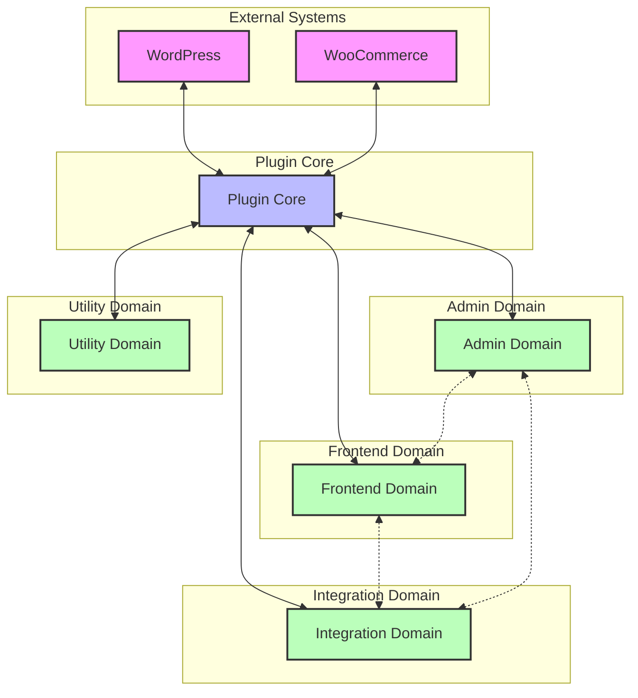

# Service Boundaries & Component Interfaces

This document defines the clear boundaries between services and the interfaces through which they communicate in the WordPress/WooCommerce Product Personalization Plugin.

## 1. Core Service Boundaries



## 2. Domain Responsibilities

### 2.1 Plugin Core

**Primary Responsibility:** Orchestrate plugin initialization, manage dependencies, and provide core services to all domains.

**Key Boundaries:**
- **WordPress Boundary:** Interacts with WordPress through hooks, filters, and API calls
- **WooCommerce Boundary:** Integrates with WooCommerce through hooks, filters, and API extensions
- **Domain Boundaries:** Initializes and coordinates all domain services

### 2.2 Admin Domain

**Primary Responsibility:** Provide all administrative interfaces and functionality for configuring the plugin and products.

**Key Boundaries:**
- **User Interface Boundary:** Presents admin screens, forms, and visual interfaces
- **Data Management Boundary:** Validates and processes admin inputs before passing to core services
- **Asset Management Boundary:** Handles admin-specific assets (JS, CSS, media)

### 2.3 Frontend Domain

**Primary Responsibility:** Deliver customer-facing personalization interfaces and preview functionality.

**Key Boundaries:**
- **User Interface Boundary:** Renders frontend customizer and controls
- **Rendering Boundary:** Manages canvas/DOM rendering for previews
- **Input Validation Boundary:** Validates customer inputs before processing

### 2.4 Integration Domain

**Primary Responsibility:** Connect personalization functionality with cart, checkout, and order processes.

**Key Boundaries:**
- **Cart Boundary:** Extends cart functionality with personalization data
- **Order Boundary:** Manages personalization data throughout order lifecycle
- **Output Generation Boundary:** Creates print-ready files and previews

### 2.5 Utility Domain

**Primary Responsibility:** Provide cross-cutting concerns and shared services to all domains.

**Key Boundaries:**
- **Performance Boundary:** Optimizes resource usage across domains
- **Accessibility Boundary:** Ensures WCAG compliance in all interfaces
- **Localization Boundary:** Manages translations and internationalization
- **Error Handling Boundary:** Provides consistent error management
## 3. Component Interface Definitions

### 3.1 Plugin Core Interfaces

#### 3.1.1 Plugin Controller Interface

```php
interface PluginControllerInterface {
    /**
     * Initialize the plugin and all its components
     * @return bool Success status
     */
    public function initialize(): bool;
    
    /**
     * Get plugin configuration value
     * @param string $key Configuration key
     * @param mixed $default Default value if not found
     * @return mixed Configuration value
     */
    public function getConfig(string $key, $default = null);
    
    /**
     * Set plugin configuration value
     * @param string $key Configuration key
     * @param mixed $value Configuration value
     * @return bool Success status
     */
    public function setConfig(string $key, $value): bool;
    
    /**
     * Get service instance by ID
     * @param string $serviceId Service identifier
     * @return object|null Service instance or null if not found
     */
    public function getService(string $serviceId);
}
```

#### 3.1.2 Data Manager Interface

```php
interface DataManagerInterface {
    /**
     * Get product personalization configuration
     * @param int $productId WooCommerce product ID
     * @return array|null Configuration data or null if not found
     */
    public function getProductConfig(int $productId): ?array;
    
    /**
     * Save product personalization configuration
     * @param int $productId WooCommerce product ID
     * @param array $config Configuration data
     * @return bool Success status
     */
    public function saveProductConfig(int $productId, array $config): bool;
    
    /**
     * Get assets by type with optional filtering
     * @param string $type Asset type (font, image, clipart, color)
     * @param array $filters Optional filters
     * @return array Assets matching criteria
     */
    public function getAssets(string $type, array $filters = []): array;
    
    /**
     * Save an asset
     * @param array $assetData Asset data
     * @return int|bool Asset ID on success, false on failure
     */
    public function saveAsset(array $assetData);
    
    /**
     * Get personalization data for an order item
     * @param int $orderId WooCommerce order ID
     * @param int $itemId Order item ID
     * @return array|null Personalization data or null if not found
     */
    public function getOrderItemPersonalization(int $orderId, int $itemId): ?array;
    
    /**
     * Save personalization data for an order item
     * @param int $orderId WooCommerce order ID
     * @param int $itemId Order item ID
     * @param array $data Personalization data
     * @return bool Success status
     */
    public function saveOrderItemPersonalization(int $orderId, int $itemId, array $data): bool;
}
```

#### 3.1.3 Asset Manager Interface

```php
interface AssetManagerInterface {
    /**
     * Upload and process a new asset
     * @param array $file File data ($_FILES array format)
     * @param string $type Asset type
     * @param array $metadata Additional metadata
     * @return array|WP_Error Asset data on success, WP_Error on failure
     */
    public function uploadAsset(array $file, string $type, array $metadata = []);
    
    /**
     * Get URL for an asset
     * @param int $assetId Asset ID
     * @return string|null Asset URL or null if not found
     */
    public function getAssetUrl(int $assetId): ?string;
    
    /**
     * Optimize an asset
     * @param int $assetId Asset ID
     * @param array $options Optimization options
     * @return bool Success status
     */
    public function optimizeAsset(int $assetId, array $options = []): bool;
    
    /**
     * Delete an asset
     * @param int $assetId Asset ID
     * @return bool Success status
     */
    public function deleteAsset(int $assetId): bool;
}
```

#### 3.1.4 Hook Manager Interface

```php
interface HookManagerInterface {
    /**
     * Register a WordPress action
     * @param string $hook Hook name
     * @param callable $callback Callback function
     * @param int $priority Priority (default: 10)
     * @param int $args Number of arguments (default: 1)
     * @return bool Success status
     */
    public function registerAction(string $hook, callable $callback, int $priority = 10, int $args = 1): bool;
    
    /**
     * Register a WordPress filter
     * @param string $hook Hook name
     * @param callable $callback Callback function
     * @param int $priority Priority (default: 10)
     * @param int $args Number of arguments (default: 1)
     * @return bool Success status
     */
    public function registerFilter(string $hook, callable $callback, int $priority = 10, int $args = 1): bool;
    
    /**
     * Remove a registered hook
     * @param string $hook Hook name
     * @param callable $callback Callback function
     * @param int $priority Priority (default: 10)
     * @return bool Success status
     */
    public function removeHook(string $hook, callable $callback, int $priority = 10): bool;
    
    /**
     * Execute a custom plugin action
     * @param string $name Action name
     * @param mixed ...$args Arguments
     * @return mixed Action result
     */
    public function executeAction(string $name, ...$args);
}
```
### 3.2 Admin Domain Interfaces

#### 3.2.1 Admin Settings Interface

```php
interface AdminSettingsInterface {
    /**
     * Register admin menu and pages
     * @return void
     */
    public function registerAdminMenu(): void;
    
    /**
     * Render admin page
     * @return void
     */
    public function renderAdminPage(): void;
    
    /**
     * Save settings
     * @param array $data Form data
     * @return bool Success status
     */
    public function saveSettings(array $data): bool;
    
    /**
     * Get settings
     * @param string|null $section Optional section name
     * @return array Settings data
     */
    public function getSettings(?string $section = null): array;
    
    /**
     * Render a specific settings tab
     * @param string $tabId Tab identifier
     * @return void
     */
    public function renderTab(string $tabId): void;
}
```

#### 3.2.2 Product Designer Interface

```php
interface ProductDesignerInterface {
    /**
     * Initialize the designer for a product
     * @param int $productId WooCommerce product ID
     * @return array Designer initialization data
     */
    public function initializeDesigner(int $productId): array;
    
    /**
     * Save design configuration
     * @param int $productId WooCommerce product ID
     * @param array $designData Design configuration data
     * @return bool Success status
     */
    public function saveDesign(int $productId, array $designData): bool;
    
    /**
     * Load existing design
     * @param int $productId WooCommerce product ID
     * @return array|null Design data or null if not found
     */
    public function loadDesign(int $productId): ?array;
    
    /**
     * Add personalization option
     * @param string $type Option type
     * @param array $data Option data
     * @return array Updated option data
     */
    public function addPersonalizationOption(string $type, array $data): array;
}
```

#### 3.2.3 Order Viewer Interface

```php
interface OrderViewerInterface {
    /**
     * Display personalization meta box in order screen
     * @param int $orderId WooCommerce order ID
     * @return void
     */
    public function renderOrderMetaBox(int $orderId): void;
    
    /**
     * Generate print-ready file for an order item
     * @param int $orderId WooCommerce order ID
     * @param int $itemId Order item ID
     * @return string|WP_Error PDF URL on success, WP_Error on failure
     */
    public function generatePrintFile(int $orderId, int $itemId);
    
    /**
     * Display preview of personalized product
     * @param int $orderId WooCommerce order ID
     * @param int $itemId Order item ID
     * @return string HTML markup for preview
     */
    public function displayPersonalizationPreview(int $orderId, int $itemId): string;
}
```

### 3.3 Frontend Domain Interfaces

#### 3.3.1 Frontend Controller Interface

```php
interface FrontendControllerInterface {
    /**
     * Load required scripts and styles
     * @return void
     */
    public function enqueueFrontendAssets(): void;
    
    /**
     * Initialize the customizer for a product
     * @param int $productId WooCommerce product ID
     * @return array Initialization data
     */
    public function initCustomizer(int $productId): array;
    
    /**
     * Process AJAX requests
     * @param string $action Action name
     * @param array $data Request data
     * @return mixed Response data
     */
    public function handleAjaxRequest(string $action, array $data);
    
    /**
     * Display the personalize button
     * @param int $productId WooCommerce product ID
     * @return string Button HTML
     */
    public function renderPersonalizeButton(int $productId): string;
}
```

#### 3.3.2 Product Interface Interface

```php
interface ProductInterfaceInterface {
    /**
     * Add personalization button to product page
     * @param int $productId WooCommerce product ID
     * @return string Button HTML
     */
    public function addPersonalizeButton(int $productId): string;
    
    /**
     * Update displayed price based on personalization options
     * @param int $productId WooCommerce product ID
     * @param array $options Selected personalization options
     * @return float Updated price
     */
    public function updateProductPrice(int $productId, array $options): float;
    
    /**
     * Validate personalization options
     * @param array $options Personalization options
     * @return array Validation results with errors if any
     */
    public function validatePersonalizationOptions(array $options): array;
    
    /**
     * Open the customizer interface
     * @param int $productId WooCommerce product ID
     * @return array Customizer initialization data
     */
    public function triggerCustomizer(int $productId): array;
}
```

#### 3.3.3 Customizer Panel Interface

```php
interface CustomizerPanelInterface {
    /**
     * Display the customizer panel
     * @param int $productId WooCommerce product ID
     * @param array $config Product configuration
     * @return string Panel HTML
     */
    public function renderCustomizerPanel(int $productId, array $config): string;
    
    /**
     * Get current personalization choices
     * @return array Personalization data
     */
    public function getPersonalizationData(): array;
    
    /**
     * Validate user input
     * @param string $field Field name
     * @param mixed $value Field value
     * @return array Validation results with errors if any
     */
    public function validateInput(string $field, $value): array;
    
    /**
     * Apply personalization choices
     * @return array Applied personalization data
     */
    public function applyPersonalization(): array;
}
```

#### 3.3.4 Live Preview Interface

```php
interface LivePreviewInterface {
    /**
     * Initialize the preview canvas
     * @param int $productId WooCommerce product ID
     * @param array $config Product configuration
     * @return array Initialization result
     */
    public function initPreview(int $productId, array $config): array;
    
    /**
     * Update preview with new personalization data
     * @param array $changes Changed personalization data
     * @return bool Success status
     */
    public function updatePreview(array $changes): bool;
    
    /**
     * Create image of current preview
     * @return string Image data URL
     */
    public function generatePreviewImage(): string;
    
    /**
     * Apply formatting to text elements
     * @param string $text Text content
     * @param array $options Formatting options
     * @return array Formatting result
     */
    public function applyTextFormatting(string $text, array $options): array;
}
```
### 3.4 Integration Domain Interfaces

#### 3.4.1 Cart Integration Interface

```php
interface CartIntegrationInterface {
    /**
     * Add personalized product to cart
     * @param int $productId WooCommerce product ID
     * @param array $personalizationData Personalization data
     * @return bool Success status
     */
    public function addToCart(int $productId, array $personalizationData): bool;
    
    /**
     * Show personalization info in cart
     * @param int $cartItemId Cart item ID
     * @return string HTML markup for cart display
     */
    public function displayCartItemMeta(int $cartItemId): string;
    
    /**
     * Create thumbnail for cart display
     * @param array $personalizationData Personalization data
     * @return string Thumbnail URL
     */
    public function generateCartThumbnail(array $personalizationData): string;
    
    /**
     * Allow editing personalization from cart
     * @param int $cartItemId Cart item ID
     * @return array|WP_Error Edit data on success, WP_Error on failure
     */
    public function enableEditPersonalization(int $cartItemId);
}
```

#### 3.4.2 Order Integration Interface

```php
interface OrderIntegrationInterface {
    /**
     * Save personalization data with order
     * @param int $orderId WooCommerce order ID
     * @param int $itemId Order item ID
     * @param array $personalizationData Personalization data
     * @return bool Success status
     */
    public function saveOrderItemMeta(int $orderId, int $itemId, array $personalizationData): bool;
    
    /**
     * Get personalization data for order item
     * @param int $orderId WooCommerce order ID
     * @param int $itemId Order item ID
     * @return array|null Personalization data or null if not found
     */
    public function getOrderItemPersonalization(int $orderId, int $itemId): ?array;
    
    /**
     * Check if editing personalization is allowed
     * @param int $orderId WooCommerce order ID
     * @param int $itemId Order item ID
     * @return bool True if editing is allowed
     */
    public function canEditPersonalization(int $orderId, int $itemId): bool;
    
    /**
     * Handle order status changes
     * @param int $orderId WooCommerce order ID
     * @param string $newStatus New order status
     * @return void
     */
    public function orderStatusChanged(int $orderId, string $newStatus): void;
}
```

#### 3.4.3 PDF Generator Interface

```php
interface PdfGeneratorInterface {
    /**
     * Create PDF for a personalized product
     * @param array $personalizationData Personalization data
     * @return string|WP_Error PDF URL on success, WP_Error on failure
     */
    public function generateProductPdf(array $personalizationData);
    
    /**
     * Create PDFs for all items in an order
     * @param int $orderId WooCommerce order ID
     * @return array Array of PDF URLs indexed by item ID
     */
    public function generateOrderPdfs(int $orderId): array;
    
    /**
     * Embed required fonts in PDF
     * @param object $pdf PDF object
     * @param array $fonts Fonts to embed
     * @return bool Success status
     */
    public function embedFonts($pdf, array $fonts): bool;
    
    /**
     * Apply print-specific settings to PDF
     * @param object $pdf PDF object
     * @param array $specs Print specifications
     * @return bool Success status
     */
    public function applyPrintSpecifications($pdf, array $specs): bool;
}
```

### 3.5 Utility Domain Interfaces

#### 3.5.1 Performance Service Interface

```php
interface PerformanceServiceInterface {
    /**
     * Optimize loading of assets
     * @return void
     */
    public function optimizeAssets(): void;
    
    /**
     * Apply lazy loading techniques
     * @return void
     */
    public function implementLazyLoading(): void;
    
    /**
     * Cache a resource
     * @param string $key Cache key
     * @param mixed $data Data to cache
     * @param int $expiration Expiration time in seconds
     * @return bool Success status
     */
    public function cacheResource(string $key, $data, int $expiration = 3600): bool;
    
    /**
     * Measure execution time of an operation
     * @param callable $operation Operation to measure
     * @return array Result with execution time and operation result
     */
    public function measurePerformance(callable $operation): array;
}
```

#### 3.5.2 Localization Service Interface

```php
interface LocalizationServiceInterface {
    /**
     * Register translatable strings
     * @return void
     */
    public function registerTranslations(): void;
    
    /**
     * Translate a string
     * @param string $string String to translate
     * @param string $domain Text domain
     * @return string Translated string
     */
    public function translateString(string $string, string $domain = 'product-personalizer'): string;
    
    /**
     * Check if current language is RTL
     * @return bool True if RTL
     */
    public function isRtl(): bool;
    
    /**
     * Format currency amount
     * @param float $amount Amount
     * @param string $currency Currency code
     * @return string Formatted currency
     */
    public function formatCurrency(float $amount, string $currency = ''): string;
}
```

#### 3.5.3 Accessibility Service Interface

```php
interface AccessibilityServiceInterface {
    /**
     * Add ARIA attributes to element
     * @param string $elementId Element ID
     * @param array $attributes ARIA attributes
     * @return void
     */
    public function addAriaAttributes(string $elementId, array $attributes): void;
    
    /**
     * Set up keyboard navigation
     * @param string $containerId Container element ID
     * @return void
     */
    public function setupKeyboardNavigation(string $containerId): void;
    
    /**
     * Manage focus for an element
     * @param string $elementId Element ID
     * @return void
     */
    public function manageFocus(string $elementId): void;
    
    /**
     * Announce message to screen readers
     * @param string $message Message to announce
     * @return void
     */
    public function announceToScreenReader(string $message): void;
}
```

#### 3.5.4 Error Service Interface

```php
interface ErrorServiceInterface {
    /**
     * Log an error with context
     * @param mixed $error Error object or message
     * @param array $context Error context
     * @return bool Success status
     */
    public function logError($error, array $context = []): bool;
    
    /**
     * Show user-friendly error
     * @param string $message Error message
     * @param string $type Error type (error, warning, info)
     * @return void
     */
    public function displayUserError(string $message, string $type = 'error'): void;
    
    /**
     * Report error to admin/developer
     * @param mixed $error Error object or message
     * @return bool Success status
     */
    public function reportError($error): bool;
    
    /**
     * Check if debug mode is enabled
     * @return bool True if debug mode is enabled
     */
    public function isDebugMode(): bool;
}
```
## 4. Data Transfer Objects (DTOs)

### 4.1 Product Configuration DTO

```php
class ProductConfigDTO {
    /** @var int */
    public $id;
    
    /** @var string */
    public $name;
    
    /** @var string */
    public $description;
    
    /** @var AssetDTO[] */
    public $assets = [];
    
    /** @var PersonalizationOptionDTO[] */
    public $personalizationOptions = [];
    
    /** @var PriceModifierDTO[] */
    public $priceModifiers = [];
    
    /** @var bool */
    public $isActive = true;
}
```

### 4.2 Asset DTO

```php
class AssetDTO {
    /** @var int */
    public $id;
    
    /** @var string */
    public $type;
    
    /** @var string */
    public $url;
    
    /** @var array */
    public $metadata = [];
}
```

### 4.3 Personalization Option DTO

```php
class PersonalizationOptionDTO {
    /** @var string */
    public $id;
    
    /** @var string */
    public $label;
    
    /** @var string */
    public $type;
    
    /** @var array */
    public $constraints = [];
}
```

### 4.4 Price Modifier DTO

```php
class PriceModifierDTO {
    /** @var string */
    public $id;
    
    /** @var string */
    public $type;
    
    /** @var float */
    public $value;
}
```

### 4.5 Cart Item Meta DTO

```php
class CartItemMetaDTO {
    /** @var int */
    public $productId;
    
    /** @var array */
    public $personalizationData = [];
    
    /** @var string */
    public $previewPdfUrl;
}
```

### 4.6 Order Meta DTO

```php
class OrderMetaDTO {
    /** @var int */
    public $orderId;
    
    /** @var CartItemMetaDTO[] */
    public $items = [];
    
    /** @var float */
    public $totalPrice;
    
    /** @var string[] */
    public $pdfs = [];
}
```

## 5. Cross-Component Communication

### 5.1 Event System

The plugin implements a lightweight event system to allow cross-component communication without tight coupling:

```php
// Publishing an event
$this->eventManager->publish('personalization_applied', [
    'product_id' => $productId,
    'personalization_data' => $personalizationData
]);

// Subscribing to an event
$this->eventManager->subscribe('personalization_applied', function($data) {
    // Handle event
});
```

### 5.2 Common Events

| Event Name | Published By | Consumed By | Purpose |
|------------|--------------|-------------|---------|
| `product_config_saved` | Product Designer | Frontend Controller | Update frontend when config changes |
| `personalization_applied` | Customizer Panel | Cart Integration | Process personalization for cart |
| `cart_item_added` | Cart Integration | Order Integration | Prepare for potential order |
| `order_status_changed` | Order Integration | PDF Generator | Generate PDFs at appropriate time |
| `pdf_generated` | PDF Generator | Order Integration | Update order with PDF URLs |

### 5.3 REST API Communication

Components communicate across the client-server boundary using the REST API:

```
// Example REST API request flow
Frontend Customizer -> REST API -> Data Manager -> Database
```

## 6. Error Handling Across Boundaries

### 6.1 Error Response Format

All components use a standardized error response format:

```php
[
    'success' => false,
    'error_code' => 'error_code_slug',
    'message' => 'User-friendly error message',
    'data' => [
        // Additional error context
    ]
]
```

### 6.2 Error Propagation

Errors are handled at the appropriate level:

1. **Component-Level Errors:** Handled within the component if possible
2. **Cross-Component Errors:** Propagated to the calling component with context
3. **User-Facing Errors:** Formatted and displayed to the user
4. **System Errors:** Logged for debugging but presented as generic messages to users

## 7. Security at Boundaries

### 7.1 Input Validation

Each component is responsible for validating its inputs:

```php
// Example validation at component boundary
public function saveProductConfig(int $productId, array $config): bool {
    // Validate product ID
    if (!wc_get_product($productId)) {
        throw new InvalidArgumentException('Invalid product ID');
    }
    
    // Validate configuration structure
    $validator = new ConfigValidator();
    if (!$validator->isValid($config)) {
        throw new ValidationException($validator->getErrors());
    }
    
    // Process valid data
    // ...
}
```

### 7.2 Authentication and Authorization

Access control is enforced at component boundaries:

```php
// Example authorization check
public function saveProductConfig(int $productId, array $config): bool {
    // Check user capabilities
    if (!current_user_can('edit_product', $productId)) {
        throw new AuthorizationException('Insufficient permissions');
    }
    
    // Process authorized request
    // ...
}
```

## 8. Performance Considerations at Boundaries

### 8.1 Data Transfer Optimization

Components minimize data transfer across boundaries:

1. **Selective Data Retrieval:** Only request needed fields
2. **Pagination:** Use pagination for large data sets
3. **Caching:** Cache frequently accessed data
4. **Compression:** Compress large data transfers

### 8.2 Asynchronous Processing

Heavy operations are performed asynchronously:

```php
// Example asynchronous processing
public function generateOrderPdfs(int $orderId): array {
    // Queue PDF generation
    wp_schedule_single_event(
        time(),
        'product_personalizer_generate_pdfs',
        ['order_id' => $orderId]
    );
    
    return ['status' => 'queued'];
}
```

## 9. Extensibility at Boundaries

### 9.1 Filter Hooks

Components expose filter hooks at boundaries:

```php
// Example filter at component boundary
public function getProductConfig(int $productId): ?array {
    $config = $this->dataStore->getConfig($productId);
    
    // Allow modification by extensions
    return apply_filters('product_personalizer_product_config', $config, $productId);
}
```

### 9.2 Action Hooks

Components provide action hooks at key points:

```php
// Example action at component boundary
public function saveProductConfig(int $productId, array $config): bool {
    // Before save action
    do_action('product_personalizer_before_save_config', $productId, $config);
    
    $result = $this->dataStore->saveConfig($productId, $config);
    
    // After save action
    do_action('product_personalizer_after_save_config', $productId, $config, $result);
    
    return $result;
}
```

## 10. Testing Boundaries

### 10.1 Unit Testing

Each component interface has corresponding unit tests:

```php
// Example component interface test
public function testDataManagerSavesProductConfig() {
    $dataManager = new DataManager();
    $productId = 123;
    $config = ['option1' => 'value1'];
    
    $result = $dataManager->saveProductConfig($productId, $config);
    
    $this->assertTrue($result);
    $this->assertEquals($config, $dataManager->getProductConfig($productId));
}
```

### 10.2 Integration Testing

Boundary interactions are tested with integration tests:

```php
// Example boundary integration test
public function testProductDesignerSavesConfigViaDataManager() {
    $dataManager = new DataManager();
    $productDesigner = new ProductDesigner($dataManager);
    
    $productId = 123;
    $designData = ['areas' => [/* ... */]];
    
    $result = $productDesigner->saveDesign($productId, $designData);
    
    $this->assertTrue($result);
    $savedConfig = $dataManager->getProductConfig($productId);
    $this->assertArrayHasKey('areas', $savedConfig);
}
```

## 11. Implementation Guidelines

### 11.1 Dependency Injection

Components should receive their dependencies through constructor injection:

```php
class ProductDesigner implements ProductDesignerInterface {
    private $dataManager;
    private $assetManager;
    
    public function __construct(
        DataManagerInterface $dataManager,
        AssetManagerInterface $assetManager
    ) {
        $this->dataManager = $dataManager;
        $this->assetManager = $assetManager;
    }
    
    // Implementation...
}
```

### 11.2 Interface Segregation

Interfaces should be focused and cohesive:

```php
// GOOD: Focused interface
interface AssetManagerInterface {
    public function uploadAsset(array $file, string $type, array $metadata = []);
    public function getAssetUrl(int $assetId): ?string;
    public function optimizeAsset(int $assetId, array $options = []): bool;
    public function deleteAsset(int $assetId): bool;
}

// BAD: Too many responsibilities
interface AssetAndProductManagerInterface {
    public function uploadAsset(array $file, string $type, array $metadata = []);
    public function getAssetUrl(int $assetId): ?string;
    public function saveProductConfig(int $productId, array $config): bool;
    public function getProductConfig(int $productId): ?array;
}
```

### 11.3 Consistent Error Handling

All components should use consistent error handling patterns:

```php
try {
    $result = $this->dataManager->saveProductConfig($productId, $config);
    return [
        'success' => true,
        'data' => $result
    ];
} catch (ValidationException $e) {
    return [
        'success' => false,
        'error_code' => 'validation_error',
        'message' => $e->getMessage(),
        'data' => $e->getErrors()
    ];
} catch (AuthorizationException $e) {
    return [
        'success' => false,
        'error_code' => 'authorization_error',
        'message' => $e->getMessage()
    ];
} catch (Exception $e) {
    $this->errorService->logError($e);
    return [
        'success' => false,
        'error_code' => 'system_error',
        'message' => __('An unexpected error occurred.', 'product-personalizer')
    ];
}
```