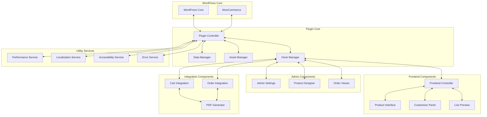
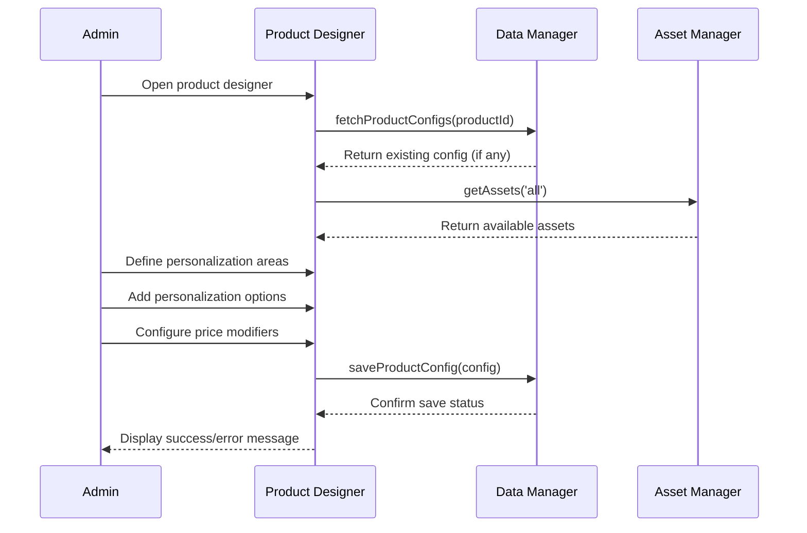
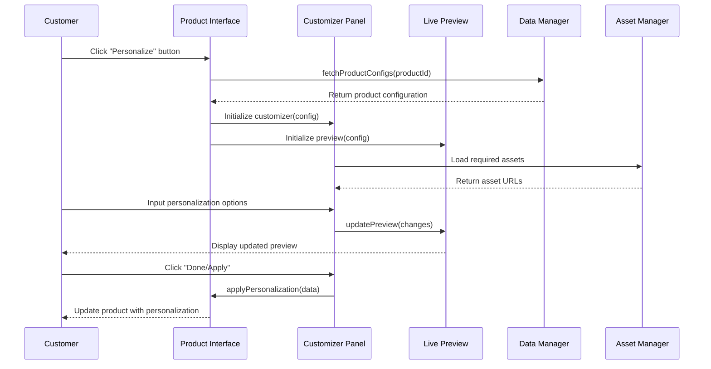
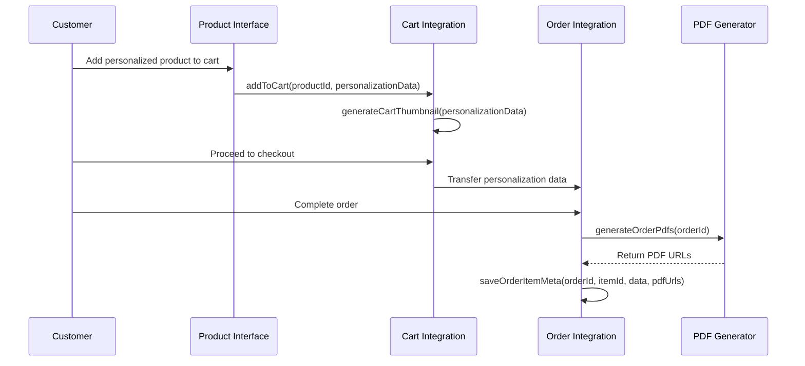

# WordPress/WooCommerce Product Personalization Plugin - System Architecture

## 1. System Overview

The Product Personalization Plugin is designed as a modular, extensible system that integrates with WordPress and WooCommerce to provide comprehensive product customization capabilities. The architecture follows a clear separation of concerns with well-defined interfaces between components.



## 2. Core Components

### 2.1 Plugin Controller

**Responsibility:** Central orchestration point that initializes the plugin, manages dependencies, and coordinates between components.

**Key Functions:**
- Plugin activation/deactivation
- Component initialization
- Dependency management
- Global configuration access

**Interfaces:**
- `initializePlugin()`: Bootstrap the plugin
- `registerHooks()`: Register WordPress/WooCommerce hooks
- `loadDependencies()`: Load required libraries and components

### 2.2 Data Manager

**Responsibility:** Handles all database operations, data validation, and schema management.

**Key Functions:**
- Database schema creation and updates
- CRUD operations for product configurations, assets, and templates
- Data validation and sanitization
- Query optimization

**Interfaces:**
- `fetchProductConfigs(productId)`: Get configuration for a product
- `saveProductConfig(config)`: Save product configuration
- `getAssets(type, filters)`: Retrieve assets by type with optional filtering
- `saveAsset(asset)`: Store a new asset
- `getOrderPersonalizationData(orderId, itemId)`: Retrieve personalization data for an order item

### 2.3 Asset Manager

**Responsibility:** Manages all plugin assets (fonts, images, clipart, color palettes).

**Key Functions:**
- Asset upload and storage
- Asset optimization and caching
- Asset retrieval and delivery
- Asset categorization and tagging

**Interfaces:**
- `uploadAsset(file, type, metadata)`: Upload and process a new asset
- `getAssetUrl(assetId)`: Get the URL for an asset
- `optimizeAsset(assetId, options)`: Apply optimization to an asset
- `deleteAsset(assetId)`: Remove an asset

### 2.4 Hook Manager

**Responsibility:** Centralizes WordPress and WooCommerce hook registrations and provides an abstraction layer for plugin components.

**Key Functions:**
- Register actions and filters
- Provide hook priority management
- Enable/disable hooks dynamically
- Hook documentation

**Interfaces:**
- `registerAction(hook, callback, priority, args)`: Register WordPress action
- `registerFilter(hook, callback, priority, args)`: Register WordPress filter
- `removeHook(hook, callback)`: Remove a registered hook
- `executeAction(name, ...args)`: Execute a custom plugin action

## 3. Admin Components

### 3.1 Admin Settings

**Responsibility:** Manages the plugin's admin interface, settings pages, and configuration options.

**Key Functions:**
- Render admin menu and pages
- Handle settings form submissions
- Validate and save settings
- Provide tabbed interface for different settings sections

**Interfaces:**
- `renderAdminPage()`: Display the main admin page
- `saveSettings(data)`: Save plugin settings
- `getSettings()`: Retrieve current settings
- `renderTab(tabId)`: Render a specific settings tab

### 3.2 Product Designer

**Responsibility:** Provides the visual designer interface for configuring product personalization options.

**Key Functions:**
- Canvas-based product image display
- Drawing tools for personalization areas
- Layer management
- Tool panels for personalization options

**Interfaces:**
- `renderDesigner(productId)`: Initialize the designer for a product
- `saveDesign(productId, designData)`: Save the design configuration
- `loadDesign(productId)`: Load an existing design
- `addPersonalizationOption(type, data)`: Add a new personalization option

### 3.3 Order Viewer

**Responsibility:** Extends WooCommerce order admin views to display personalization data and previews.

**Key Functions:**
- Display personalization data in order details
- Show visual previews of personalized products
- Provide PDF generation controls
- Order item meta display

**Interfaces:**
- `renderOrderMetaBox(orderId)`: Display personalization meta box in order screen
- `generatePrintFile(orderId, itemId)`: Generate print-ready file for an order item
- `displayPersonalizationPreview(orderId, itemId)`: Show preview of personalized product

## 4. Frontend Components

### 4.1 Frontend Controller

**Responsibility:** Coordinates frontend functionality, script/style loading, and user interactions.

**Key Functions:**
- Enqueue frontend assets
- Initialize frontend components
- Handle AJAX/REST requests
- Manage frontend state

**Interfaces:**
- `enqueueFrontendAssets()`: Load required scripts and styles
- `initCustomizer(productId)`: Initialize the customizer for a product
- `handleAjaxRequest(action, data)`: Process AJAX requests
- `renderPersonalizeButton(productId)`: Display the personalize button

### 4.2 Product Interface

**Responsibility:** Integrates with WooCommerce product pages to add personalization functionality.

**Key Functions:**
- Add personalization button to product page
- Handle product page integration
- Trigger customizer display
- Update product pricing based on personalization

**Interfaces:**
- `addPersonalizeButton(productId)`: Add button to product page
- `updateProductPrice(productId, options)`: Update displayed price
- `validatePersonalizationOptions(options)`: Validate customer inputs
- `triggerCustomizer(productId)`: Open the customizer interface

### 4.3 Customizer Panel

**Responsibility:** Provides the UI for customers to input personalization options.

**Key Functions:**
- Display personalization form fields
- Handle user input validation
- Manage option interactions
- Provide accessible controls

**Interfaces:**
- `renderCustomizerPanel(productId, config)`: Display the customizer panel
- `getPersonalizationData()`: Get current personalization choices
- `validateInput(field, value)`: Validate user input
- `applyPersonalization()`: Apply personalization choices

### 4.4 Live Preview

**Responsibility:** Renders real-time visual preview of personalized product.

**Key Functions:**
- Canvas-based rendering
- Real-time updates
- Image manipulation
- Text rendering with custom fonts

**Interfaces:**
- `initPreview(productId, config)`: Initialize the preview canvas
- `updatePreview(changes)`: Update preview with new personalization data
- `generatePreviewImage()`: Create image of current preview
- `applyTextFormatting(text, options)`: Apply formatting to text elements

## 5. Integration Components

### 5.1 Cart Integration

**Responsibility:** Handles integration with WooCommerce cart functionality.

**Key Functions:**
- Add personalization data to cart items
- Display personalization summary in cart
- Generate preview thumbnails
- Provide edit functionality

**Interfaces:**
- `addToCart(productId, personalizationData)`: Add personalized product to cart
- `displayCartItemMeta(cartItemId)`: Show personalization info in cart
- `generateCartThumbnail(personalizationData)`: Create thumbnail for cart display
- `enableEditPersonalization(cartItemId)`: Allow editing personalization from cart

### 5.2 Order Integration

**Responsibility:** Manages personalization data throughout the order process.

**Key Functions:**
- Transfer personalization data from cart to order
- Store personalization data with order items
- Prevent edits after payment
- Order status management

**Interfaces:**
- `saveOrderItemMeta(orderId, itemId, personalizationData)`: Save data with order
- `getOrderItemPersonalization(orderId, itemId)`: Get personalization data
- `canEditPersonalization(orderId, itemId)`: Check if editing is allowed
- `orderStatusChanged(orderId, newStatus)`: Handle order status changes

### 5.3 PDF Generator

**Responsibility:** Creates print-ready PDF files for personalized products.

**Key Functions:**
- Vector PDF generation
- Font embedding
- Image processing
- Print specifications

**Interfaces:**
- `generateProductPdf(personalizationData)`: Create PDF for a personalized product
- `generateOrderPdfs(orderId)`: Create PDFs for all items in an order
- `embedFonts(pdf, fonts)`: Embed required fonts in PDF
- `applyPrintSpecifications(pdf, specs)`: Apply print-specific settings

## 6. Utility Services

### 6.1 Performance Service

**Responsibility:** Optimizes plugin performance and resource usage.

**Key Functions:**
- Asset optimization
- Lazy loading
- Caching strategies
- Performance monitoring

**Interfaces:**
- `optimizeAssets()`: Optimize loading of assets
- `implementLazyLoading()`: Apply lazy loading techniques
- `cacheResource(key, data, expiration)`: Cache a resource
- `measurePerformance(operation)`: Measure execution time

### 6.2 Localization Service

**Responsibility:** Handles internationalization and localization.

**Key Functions:**
- String translation
- RTL support
- Date/time formatting
- Currency formatting

**Interfaces:**
- `registerTranslations()`: Register translatable strings
- `translateString(string, domain)`: Translate a string
- `isRtl()`: Check if current language is RTL
- `formatCurrency(amount, currency)`: Format currency amount

### 6.3 Accessibility Service

**Responsibility:** Ensures plugin interfaces meet accessibility standards.

**Key Functions:**
- ARIA attribute management
- Keyboard navigation
- Focus management
- Screen reader compatibility

**Interfaces:**
- `addAriaAttributes(element, attributes)`: Add ARIA attributes to element
- `setupKeyboardNavigation(container)`: Set up keyboard navigation
- `manageFocus(element)`: Manage focus for an element
- `announceToScreenReader(message)`: Announce message to screen readers

### 6.4 Error Service

**Responsibility:** Provides centralized error handling and logging.

**Key Functions:**
- Error logging
- User-friendly error messages
- Error reporting
- Debugging tools

**Interfaces:**
- `logError(error, context)`: Log an error with context
- `displayUserError(message, type)`: Show user-friendly error
- `reportError(error)`: Report error to admin/developer
- `isDebugMode()`: Check if debug mode is enabled

## 7. Data Flow Diagrams

### 7.1 Product Configuration Flow



### 7.2 Frontend Personalization Flow



### 7.3 Cart and Order Flow



## 8. Database Schema

### 8.1 Custom Tables

```
wp_product_personalizer_assets
- id (PK)
- type (font, image, clipart, color)
- name
- url
- metadata (JSON)
- created_at
- updated_at

wp_product_personalizer_templates (Optional)
- id (PK)
- name
- configuration (JSON)
- created_at
- updated_at
```

### 8.2 WordPress/WooCommerce Meta

```
Product Meta:
- _product_personalization_enabled (boolean)
- _product_personalization_config_json (JSON)

Order Item Meta:
- _personalization_data (JSON)
- _personalization_preview_url (string)
- _personalization_print_file_url (string)
```

## 9. REST API Endpoints

```
Namespace: product-personalizer/v1

Endpoints:
- GET /products/{id}/config - Get personalization config for product
- POST /products/{id}/config - Save personalization config for product
- GET /assets - Get assets (filtered by type, etc.)
- POST /assets - Upload new asset
- GET /templates - Get saved templates (optional)
- POST /templates - Save new template (optional)
- POST /preview/generate - Generate preview image
- GET /cart/item-data - Get personalization data for cart item
- POST /cart/item-data - Update personalization data for cart item
- POST /orders/{order_id}/item/{item_id}/generate-print-file - Generate print file
```

## 10. Service Boundaries & Interfaces

### 10.1 Core System Boundaries

The plugin maintains clear boundaries with WordPress and WooCommerce through:

1. **Hook-based Integration**: Using standard WordPress/WooCommerce hooks and filters
2. **Database Isolation**: Custom tables with clear prefixes
3. **Asset Separation**: Plugin-specific assets in dedicated directories
4. **API Namespacing**: Dedicated REST API namespace

### 10.2 Component Interface Contracts

Each component exposes a well-defined public interface while keeping implementation details private:

1. **Data Manager**:
   - Input: Validated data objects matching defined schemas
   - Output: Standardized response objects with success/error status

2. **Asset Manager**:
   - Input: File objects with metadata
   - Output: Asset objects with URLs and optimization status

3. **Frontend Components**:
   - Input: Product configuration and user inputs
   - Output: Rendered UI elements and validated personalization data

4. **PDF Generator**:
   - Input: Personalization data with clear specifications
   - Output: PDF file URL or error details

### 10.3 Error Handling Boundaries

Error handling follows a consistent pattern across boundaries:

1. **Component-level Validation**: Each component validates its inputs
2. **Standardized Error Objects**: Common error format across components
3. **User-facing vs. Log-only Errors**: Clear separation between errors shown to users and those only logged
4. **Graceful Degradation**: Components fail safely without breaking the entire system

## 11. Security Architecture

### 11.1 Authentication & Authorization

- WordPress capability checks for all admin actions
- Nonce validation for all form submissions
- REST API endpoints secured with WordPress authentication

### 11.2 Data Validation & Sanitization

- Input validation at component boundaries
- Sanitization of all user inputs
- Prepared statements for database queries
- Output escaping for all displayed data

### 11.3 File Security

- File type validation for uploads
- Secure file storage with proper permissions
- Sanitized filenames
- Size limitations and quota management

## 12. Performance Optimization Strategy

### 12.1 Frontend Optimization

- Lazy loading of assets
- Efficient canvas rendering with debouncing
- Code splitting and conditional loading
- Minification and compression

### 12.2 Backend Optimization

- Database query optimization
- Caching of product configurations
- Efficient asset storage and retrieval
- Asynchronous PDF generation for large orders

### 12.3 Asset Optimization

- Image optimization (WebP format, proper sizing)
- Font subsetting for custom fonts
- SVG optimization for clipart
- CDN integration (optional)

## 13. Extensibility Points

### 13.1 Filters

```php
// Allow modification of personalization options
apply_filters('product_personalizer_options', $options, $product_id);

// Filter personalization data before saving to cart
apply_filters('product_personalizer_cart_data', $personalization_data, $product_id);

// Modify PDF generation settings
apply_filters('product_personalizer_pdf_settings', $pdf_settings, $order_id, $item_id);
```

### 13.2 Actions

```php
// Fired when personalization is applied
do_action('product_personalizer_personalization_applied', $product_id, $personalization_data);

// Fired before PDF generation
do_action('product_personalizer_before_pdf_generation', $order_id, $item_id);

// Fired after PDF generation
do_action('product_personalizer_after_pdf_generation', $order_id, $item_id, $pdf_url);
```

### 13.3 JavaScript Events

```javascript
// Triggered when customizer is initialized
document.dispatchEvent(new CustomEvent('product_personalizer_customizer_initialized', {
  detail: { productId: productId }
}));

// Triggered when preview is updated
document.dispatchEvent(new CustomEvent('product_personalizer_preview_updated', {
  detail: { personalizationData: data }
}));
```

## 14. Accessibility Architecture

### 14.1 Admin Interface

- ARIA landmarks and roles
- Keyboard navigation
- Focus management
- High contrast mode support

### 14.2 Frontend Customizer

- Screen reader announcements for preview updates
- Keyboard accessible controls
- Clear instructions and error messages
- Focus trapping in modal dialogs

### 14.3 Testing & Compliance

- Automated accessibility testing integration
- WCAG 2.1 AA compliance checklist
- Screen reader testing procedures
- Keyboard navigation testing

## 15. Internationalization Architecture

### 15.1 Text Domains

- Main plugin text domain: 'product-personalizer'
- All user-facing strings wrapped in translation functions

### 15.2 RTL Support

- CSS variables for directional properties
- RTL-aware layouts
- Bidirectional text support in canvas rendering

### 15.3 Localization Files

- POT file generation
- Support for translation management systems
- Dynamic loading of translation files

## 16. Testing Architecture

### 16.1 Unit Testing

- PHPUnit for PHP components
- Jest for JavaScript components
- Mock objects for external dependencies

### 16.2 Integration Testing

- WordPress testing framework integration
- WooCommerce test case extensions
- API endpoint testing

### 16.3 End-to-End Testing

- Browser automation testing
- User flow validation
- Cross-browser compatibility testing

## 17. Deployment Considerations

### 17.1 Plugin Activation

- Database table creation
- Default settings initialization
- Capability checks
- Compatibility verification

### 17.2 Updates

- Database schema migrations
- Settings preservation
- Backward compatibility
- Asset management during updates

### 17.3 Deactivation & Uninstallation

- Clean data removal option
- Temporary data preservation
- Database cleanup
- File system cleanup